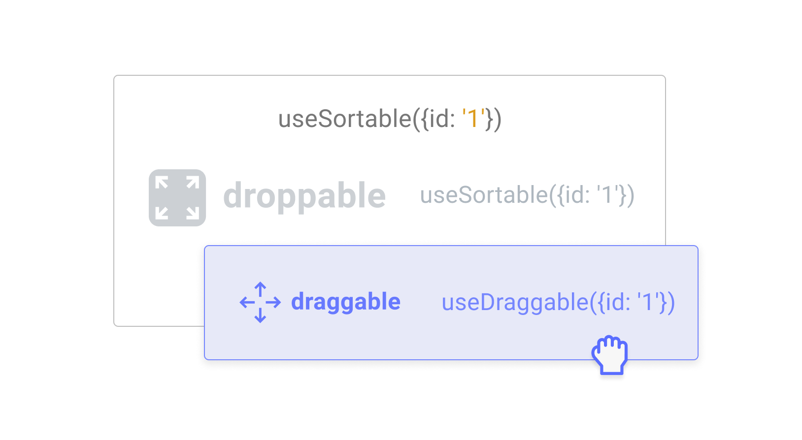

# useSortable

The `useSortable` hook is an abstraction that composes the [`useDroppable`](../../api-documentation/droppable.md) and [`useDraggable`](../../api-documentation/draggable/) hooks. 




To function properly, the `useSortable` hook needs to be used within a descendant of a [`SortableContext`](sortable-context.md) provider higher up in the tree.


If you're already familiar with the [`useDraggable`](../../api-documentation/draggable/) hook, the `useSortable` hook should look very familiar, since, it is an abstraction on top of it. 

In addition to the `attributes`, `listeners`,`transform`  and `setNodeRef` arguments, which you should already be familiar with if you've used the `useDraggable` hook before, you'll notice that the `useSortable` hook also provides a `transition` argument.

```jsx
import React from 'react';
import {useSortable} from '@dnd-kit/sortable';
import {CSS} from '@dnd-kit/utilities';

function SortableItem(props) {
  const {
    attributes,
    listeners,
    setNodeRef,
    transform,
    transition,
  } = useSortable({id: props.id});
  
  const style = {
    transform: CSS.Transform.toString(transform),
    transition,
  };
  
  return (
    <div ref={setNodeRef} style={style} {...attributes} {...listeners}>
      {/* ... */}
    </div>
  );
}
```

The default transition is `250` milliseconds, with an easing function set to `ease`, but you can customize this and pass any valid [CSS transition timing function](https://developer.mozilla.org/en-US/docs/Web/CSS/transition-timing-function), or set the transition argument to `null` to disable transitions entirely:

```javascript
const {
  transition,
} = useSortable({
  id: props.id,
  transition: {
    duration: 150, // milliseconds
    easing: 'cubic-bezier(0.25, 1, 0.5, 1)',
  },
});
```


